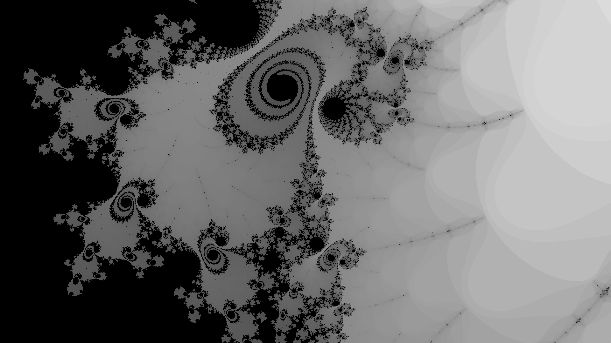
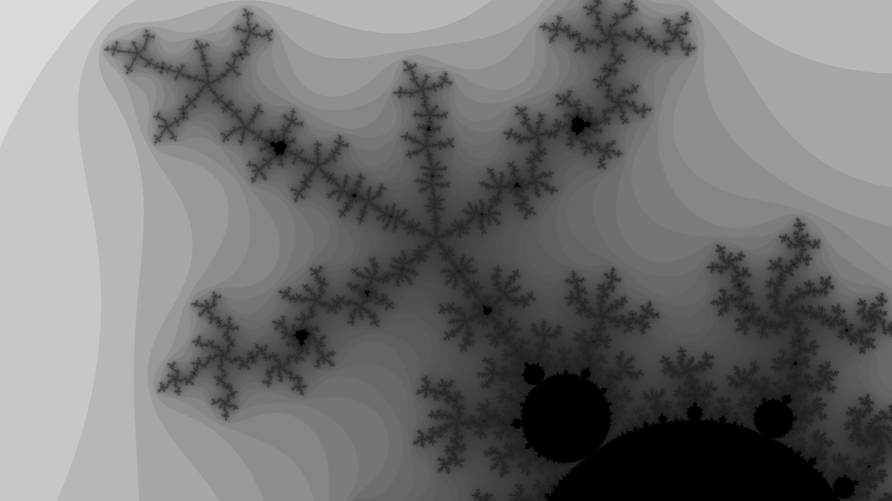
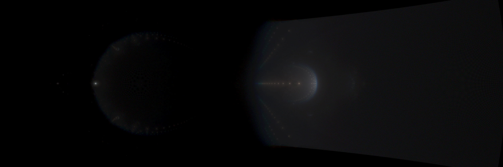

# Mandelbrot & Buddhabrot

Very small project to explore the Mandelbrot set and a couple of naïve rendering methods.

###  Gallery
The nicer looking results are obtained (in reasonable time) with an high number of sample points (`c`) and a relatively low iteration depth (`iterMax`).

Here is the other rendering method tracking the *unstable* trajectories of the system.

Instead of following the unstable orbits we can track the *stable* ones. Notice that we call a given orbit stable if it does not escape within a certain iteration threshold. The result is likewise stunning:

Some bright dots appear inside the main cardioid meaning that they are *busy* spots for the stable orbits.

